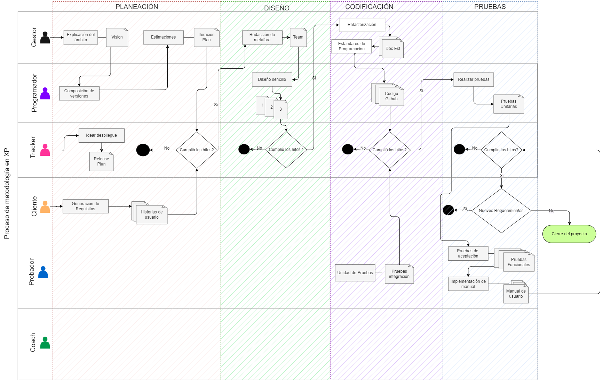

<h1 align="center">
    Escuela Politécnica Nacional 
    Facultad de Ingeniería en Sistemas 
    Metodologías Ágiles 
</h1>

### Grupo: 4
Enlace: https://epnecuador-my.sharepoint.com/:v:/g/personal/santiago_salazar_epn_edu_ec/ESk5FGgCiwlFoX7IMPO63QkBj84SBeMlxTNXNBGcDK6r6w?e=crSReC

# WorkFlow
**Artefactos del diseño sencillo**
1. Diagrama UML
2. Diagrama conceptual

