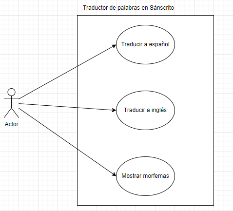
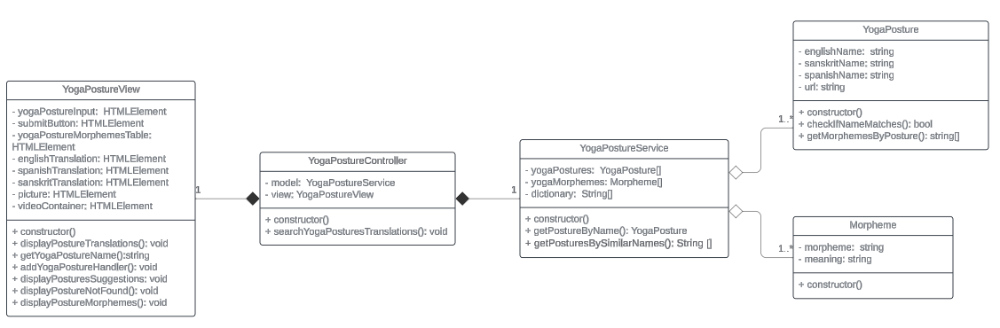

<h1 align="center">
    Escuela Politécnica Nacional 
    Facultad de Ingeniería en Sistemas 
    Metodologías Ágiles 
</h1>

[Video de evidencia](https://epnecuador-my.sharepoint.com/:v:/g/personal/paul_roman_epn_edu_ec/EY4x8LZs_1JLpyIDfNTXiBsB-EykMsPfO-yT04pHpjwzqQ?nav=eyJyZWZlcnJhbEluZm8iOnsicmVmZXJyYWxBcHAiOiJPbmVEcml2ZUZvckJ1c2luZXNzIiwicmVmZXJyYWxBcHBQbGF0Zm9ybSI6IldlYiIsInJlZmVycmFsTW9kZSI6InZpZXciLCJyZWZlcnJhbFZpZXciOiJNeUZpbGVzTGlua0NvcHkifX0&e=5JWKYi)

### Grupo: 4

### Integrantes
- Kevin Revelo
- Paúl Román
- Jonathan Salazar
- Santiago Salazar
- Sebastián Sanchez
- Nathaly Simba

# Diagramas UML 
El diagrama de casos de uso mostrado en la Figura 1 permite identificar a los actores que van a interactuar con el sistema y a su vez las funcionalidades con las que deberá contar el sistema. La traducción a español e inglés al ingresar una palabra en sanscrito y la posterior visualización de los morfemas son las funcionalidades con las que el sistema deberá contar. 

  

  <em>Figura 1: Diagrama de casos de uso del sistema de traducción</em>

En la Figura 2 se puede apreciar el diagrama de clases del sistema de traducción. Se puede observar que se tendrán dos clases base llamadas morpheme y yogaPosture. Estas dos serán usadas por la clase YogaPostureService, que posteriormente se usará como el elemento "modelo" dentro de un modelo vista controlador. 

Considerando esto, se puede apreciar que la clase YogaPostureController es el nexo entre la vista(clase que se encarga de mostrar los elementos en pantalla) y el modelo(Clase encargada de gestionar los datos y la lógica del negocio).

  

  <em>Figura 2: Diagrama de clases del sistema de traducción</em>

