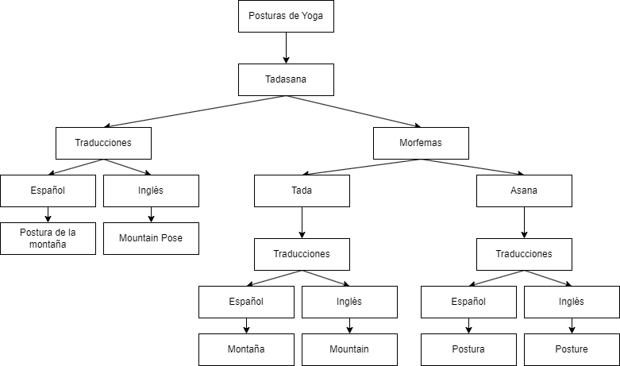

<h1 align="center">
    Escuela Politécnica Nacional 
    Facultad de Ingeniería en Sistemas 
    Metodologías Ágiles 
</h1>

### Grupo: 4

### Integrantes
- Kevin Revelo
- Paúl Román
- Jonathan Salazar
- Santiago Salazar
- Sebastián Sanchez
- Nathaly Simba

# Mapa conceptual
Se tomó como ejemplo a una postura de las enlistadas por el cliente para realizar un diagrama conceptual con todos los elementos que debe contener. 

Así, se pudo observar que tanto la postura inicialmente, como los morfemas que lo compones contienen sus respectivas traducciones tanto en inglés como en español. 