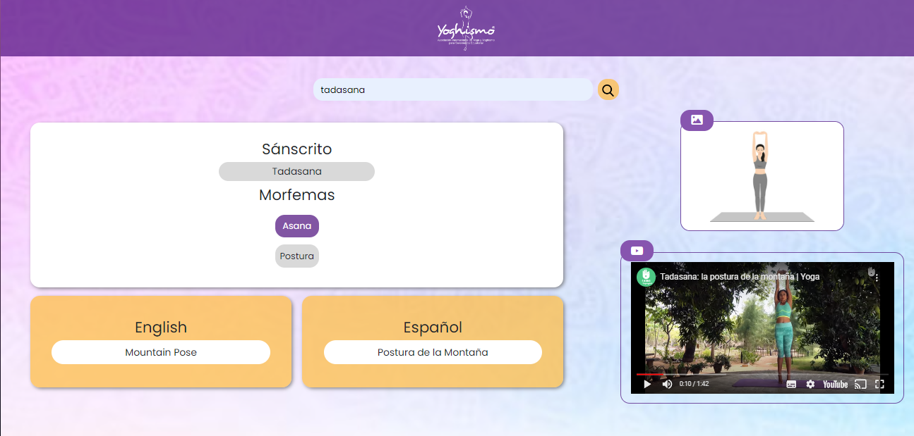

<h1 align="center">
    Escuela Politécnica Nacional 
    Facultad de Ingeniería en Sistemas 
    Metodologías Ágiles 
</h1>

[Link evidencia](https://epnecuador-my.sharepoint.com/:v:/g/personal/jonathan_salazar04_epn_edu_ec/EcNaJUMLHOdAhSKVo8h0nOoB0oP-8_pbDJIfrYBw_lHKqw?nav=eyJyZWZlcnJhbEluZm8iOnsicmVmZXJyYWxBcHAiOiJPbmVEcml2ZUZvckJ1c2luZXNzIiwicmVmZXJyYWxBcHBQbGF0Zm9ybSI6IldlYiIsInJlZmVycmFsTW9kZSI6InZpZXciLCJyZWZlcnJhbFZpZXciOiJNeUZpbGVzTGlua0NvcHkifX0&e=QoYZFW)

### Grupo: 4
### Versión 2.0

### Integrantes
- Kevin Revelo
- Paúl Román
- Jonathan Salazar
- Santiago Salazar
- Sebastián Sanchez
- Nathaly Simba

# Diseño de prototipos 

Se realizó el diseño del prototipo de alta fidelidad en la plataforma figma, como se puede ver a continuación. 

Se realizaron cambios en cuanto a la implementación de archivos multimedia en el prototipo. S colocaron videos e imagenes correspondientes a cada postura de yoga con la finalidad de mejorar la experiencia de usuario al ocupar esta aplicación. 

---
Se puede acceder al contenido en el siguiente enlace: 
[Prototipo Figma](https://www.figma.com/file/FCIhMwdpiagLvhLiKOsORq/Calidad-de-Software?type=design&node-id=0%3A1&mode=design&t=k2Z61wXAOAjMiyeV-1)