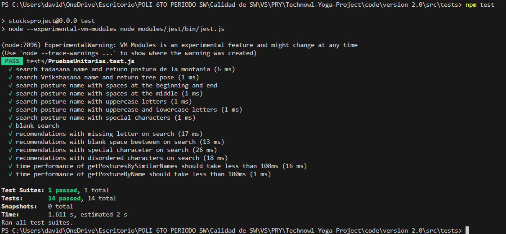
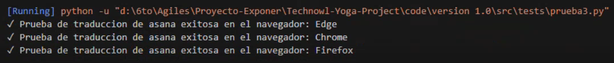

<h1 align="center">
    Escuela Politécnica Nacional 
    Facultad de Ingeniería en Sistemas 
    Metodologías Ágiles 
</h1>

[Link evidencia](https://epnecuador-my.sharepoint.com/:v:/g/personal/jonathan_salazar04_epn_edu_ec/EePxMYoR_GhGutlN43xPPKIBoNwuWkG-mnF-KRwJFYfxmA?nav=eyJyZWZlcnJhbEluZm8iOnsicmVmZXJyYWxBcHAiOiJPbmVEcml2ZUZvckJ1c2luZXNzIiwicmVmZXJyYWxBcHBQbGF0Zm9ybSI6IldlYiIsInJlZmVycmFsTW9kZSI6InZpZXciLCJyZWZlcnJhbFZpZXciOiJNeUZpbGVzTGlua0NvcHkifX0&e=B9f5hB)

### Grupo: 4

### Integrantes
- Kevin Revelo
- Paúl Román
- Jonathan Salazar
- Santiago Salazar
- Sebastián Sanchez
- Nathaly Simba

# Ejecución de pruebas unitarias
Ejecución de pruebas unitarias realizadas en jest:

Ejecución de prueba de test de integración en python:
